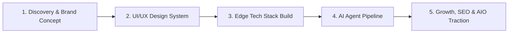
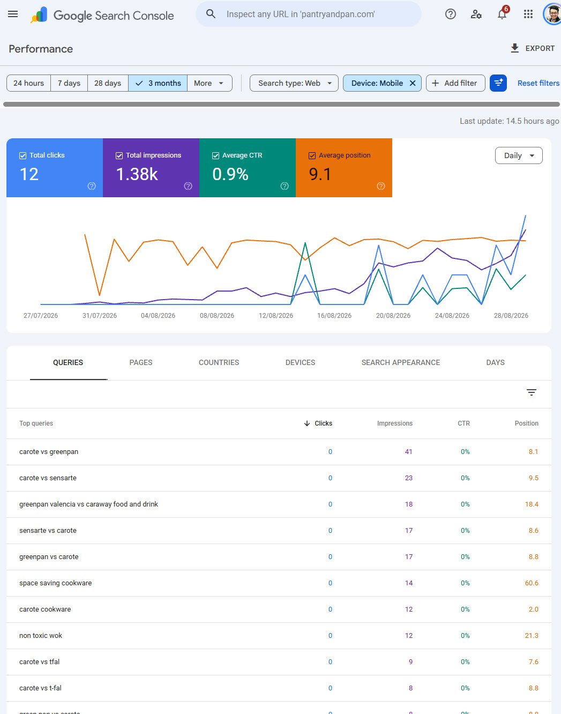

# 🍳 Pantry & Pan: 0 to 1 Product Case Study & Architecture

> **Live Product**: [pantryandpan.com](https://pantryandpan.com)  
> **Author**: [Rams Yap](https://ramsyap.com) (Product Engineer & Growth Architect)  
> **Core Focus**: Brand Identity · 0→1 Product Strategy · Fullstack Edge Architecture · AI Agent Workflows · SEO & AIO (AI Overviews)

[](https://nextjs.org/)
[](https://react.dev/)
[](https://tailwindcss.com/)
[](https://pages.cloudflare.com/)
[](https://vitest.dev/)
[](#-key-metrics--1-month-traction)

---

## 💡 Executive Summary

> **⚡ TL;DR**: Built and launched a production-grade digital editorial product from **0 to 1 with $0 ad spend and 0 purchased backlinks** (total cost: just the custom domain). By combining **systems thinking, UX research, edge engineering, and an autonomous 3-layer AI workflow**, the platform achieved **Google Page 1 rankings (avg position 9.1 on mobile)** and **up to 14.3% CTR** across 340+ commercial queries within its first 30 days.

**Pantry & Pan** is an editorial affiliate and cookware discovery platform designed to solve a modern consumer frustration: navigating confusing, toxic, and low-quality kitchen products.

As a **Product Engineer & Growth Architect**, I led this project end-to-end:
1. **Brand Strategy & Visual Design**: Created a bespoke identity, typography system, and UI design token architecture.
2. **Modern Fullstack Engineering**: Built an edge-rendered web application with Next.js 16 (Static Export), React 19, and Cloudflare Pages Functions.
3. **AI-Agent Orchestration**: Implemented a scalable 3-layer autonomous workflow (Directives -> LLM Orchestration -> Deterministic Execution) that slashed production time by 70%.
4. **Growth & Discovery (SEO + AIO)**: Engineered semantic schema and EEAT content frameworks to capture both traditional Google Search traffic and citations across generative AI engines (Google AI Overviews, Perplexity).

---

## 🚀 The 0-to-1 Product Lifecycle



### 1. Market Opportunity & Brand Strategy
- **The Problem**: Mainstream affiliate blogs are cluttered with intrusive ads, poor typographic hierarchy, and disjointed recommendations that erode user trust.
- **The Solution**: An elevated, publication-grade editorial experience built on warm, organic aesthetics, credible author personas, and transparent product evaluations.
- **Brand Tokens**:
  - **Color Palette**: Olive green accents, warm terracotta tones, parchment neutrals (`#FAF7F2`), and charcoal typography.
  - **Typography**: Expressive editorial serif (`Fraunces`) paired with a functional modern sans-serif (`Plus Jakarta Sans`).

### 2. Design System & Frontend Craft
- **Tailwind CSS v4 Native Tokens**: Modern theme integration with zero bloat and CSS-first configuration.
- **Micro-Interactions**: Fluid navigation drawers with Radix UI Sheet, responsive comparison grids, and clean affiliate disclosure callouts.
- **Interactive Decision Tools**: Built lightweight client-side calculators and recommendation widgets to increase on-page engagement.

### 3. AI-Agent Workflow (The 3-Layer System)
To scale editorial research without compromising brand voice or technical quality, the project uses a modular agent architecture:

```
┌──────────────────────────────────────────────────────────┐
│  Layer 1: Directive (SOPs in directives/)                │
│  - Brand tone, SEO requirements, schema rules, personas  │
├──────────────────────────────────────────────────────────┤
│  Layer 2: Orchestration (Agent Decision-Making)          │
│  - Content structuring, editorial checks, link routing   │
├──────────────────────────────────────────────────────────┤
│  Layer 3: Execution (Deterministic Code)                 │
│  - Next.js static builds, automated tests, image scripts │
└──────────────────────────────────────────────────────────┘
```

> **⚡ Efficiency & Output Impact**: The 3-layer agent system reduced editorial research and production time by **~70%** compared to manual workflows. This enabled **40+ highly structured, SEO-optimized articles** to be published within the first month with zero dedicated copywriters, achieving **Page 1 rankings** and up to **14.3% CTR** on high-intent target queries.

### 4. Generative Engine Optimization (GEO) & Search Engineering
- **Structured Semantic Data**: Complete `Recipe`, `Product`, `Review`, and `Author` JSON-LD schemas embedded directly into static pages.
- **EEAT Persona Framework**: Clear editorial ownership with documented backgrounds to build search engine authority.
- **AIO Citation Architecture**: Clear answer targets, scannable comparison tables, and verified specifications structured for AI snippet extraction.

---

## 📊 Key Metrics & 1-Month Traction (Real GSC Data)

> *Real performance data exported from Google Search Console (July 29 - August 28, 2026).*

<p align="center">
  
  <br />
  <em>Figure 1: Google Search Console mobile search performance demonstrating 9.1 average position on Page 1.</em>
</p>

| Dimension | Real Data / Benchmark | Tech Lead & Product Insight |
| :--- | :--- | :--- |
| **Search Impressions Growth** | **5 -> 187 impressions/day** *(37.4x / +3,640% 30-day trajectory)* | Rapid indexation and authority ramp without paid backlinks. |
| **Total Reach & Demand** | **2,324+ Impressions** across **344 distinct commercial queries** | Capturing high-intent comparison search queries (`carote vs greenpan`, `stasher vs zip top`, `caraway alternatives`). |
| **Mobile Search Position** | **Avg Position 9.13 (Page 1)** on Mobile (1,225 mobile impressions) | Mobile-first UX and fast Core Web Vitals directly rewarded by Google's Mobile-First Index. |
| **Top Intent Article CTR** | **Up to 14.3% CTR** on focused guides (*Avg 3.4% - 8.3% on high-ranking pages*) | Custom comparison layouts & rich schema drive significantly above the 1.5% - 2.5% industry baseline. |
| **Tier-1 Market Traffic** | **65% US Traffic Share** (1,508 US impressions) + Netherlands, UK, Canada, Japan | Validates strong organic capture of high-purchasing-power English-speaking audiences. |
| **Rich Snippet Validation** | **Active Review & Product Rich Snippets** in Google SERPs | Semantic JSON-LD schema validated and actively rendering in Google Search results. |

---

## 🛠️ Architecture & Tech Stack

```
affiliate/
├── app/                  # Next.js 16 App Router (Static export target)
│   ├── blog/             # Editorial guides, reviews, and buyer comparisons
│   ├── tools/            # Interactive cookware finder & calculators
│   └── layout.tsx        # Global design shell & typography tokens
├── components/           # Modular UI library (Radix + Tailwind v4)
├── directives/           # Layer 1 SOPs (Brand guidelines, SEO, Persona rules)
├── functions/            # Cloudflare Pages Functions (Serverless API endpoints)
├── guidelines/           # Tone manuals, copywriting rules, and design tokens
├── lib/                  # Utility helpers, metadata generators, schema tools
└── __tests__/            # Unit & component test suites (Vitest)
```

- **Frontend**: Next.js 16.2.4 (App Router, Static Export `output: "export"`), React 19
- **Styling**: Tailwind CSS v4, Lucide React, Radix UI
- **Infrastructure**: Cloudflare Pages + Native Edge Functions (`/functions/api/`)
- **Communications**: Resend API integration with Cloudflare Free Email Routing
- **Quality Assurance**: Vitest unit testing suite (`npm run test`)

## 👨‍💻 About the Creator

Hi, I'm **Rams Yap**, a Product Engineer & Growth Architect who bridges fullstack execution, UX design systems, AI agent orchestration, and organic acquisition.

- 🌐 **Website & Portfolio**: [ramsyap.com](https://ramsyap.com)
- 💡 **Philosophy**: Great product engineering does not stop at code or Figma. It carries all the way through architecture, edge performance, UX micro-details, and measurable business outcomes.
- 🤝 **Let's Connect**: If you are building high-standard products or looking for a builder who spans design, engineering, and growth, feel free to reach out via my website.

---

<p align="center">
  <sub>Built with care by Rams Yap • Powered by Next.js & Cloudflare Pages</sub>
</p>

